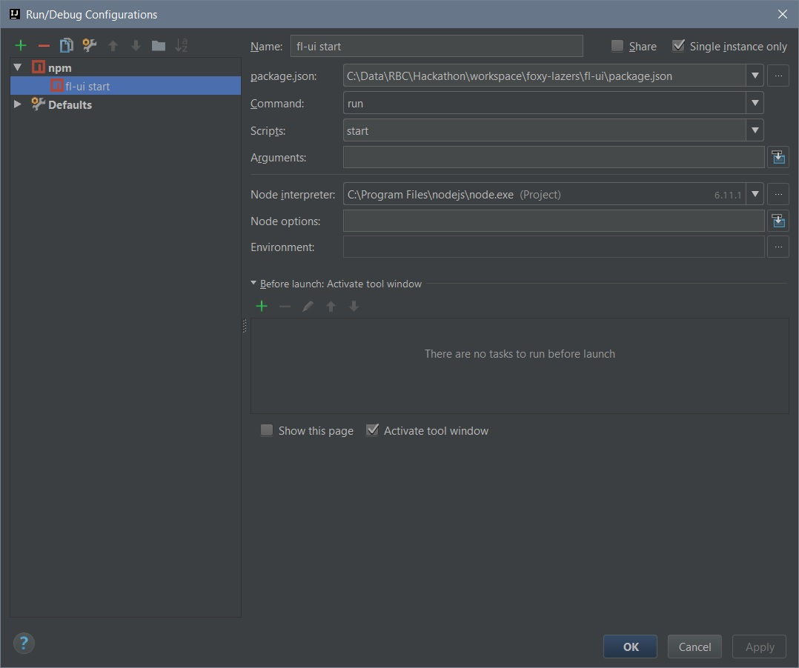

# foxy-lazers

## UI
https://bogdanmata.github.io/foxy-lazers/

## Backend
http://144.217.100.36:8080/test

Install

# UI

Module is `fl-ui`. UI application based on Angular 4.

## How to run

To start UI, use `npm run start`

# Foxy

Foxy has been made on [Piskel](https://www.piskelapp.com/)

# Docs

## State diagram
